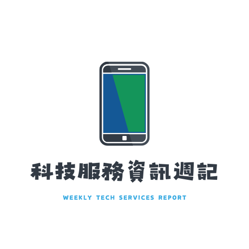

# Lazy Jerry 的 AI 科技與各專題報告

因為不小心買了一個一年份的 Manus AI ，寫信給客服還沒回，目前大概是無法退款惹。所以保持著不浪費的精神就來弄一下新聞整理的服務，看看這個網站能夠撐多久這樣。

目前主要整理兩類內容：[科技服務資訊週記](https://lazyjerry.github.io/weekly-report/) 與不定期發布的專題報告。

目前最新的專題報告為 [台灣政治貪污案：媒體框架效應與司法信任度](https://lazyjerry.github.io/topic/taiwan-political-corruption-case-second-instance-reversal-analysis/)，最後更新於 2026-03-28，聚焦分析台灣政治人物貪污案件中，二審逆轉與維持原判案例的媒體報導差異，以及其對司法信任度的影響。

目前網站已有以下專題報告：

- [台灣政治貪污案：媒體框架效應與司法信任度](https://lazyjerry.github.io/topic/taiwan-political-corruption-case-second-instance-reversal-analysis/)：分析二審逆轉、媒體框架與司法信任度之間的關聯。最後更新於 2026-03-28。
- [OpenSpec 與 Spec Kit 研究報告](https://lazyjerry.github.io/topic/openspec-vs-speckit-research/)：比較兩套 Spec-Driven Development 工具的定位、安裝方式與文件結構。最後更新於 2026-02-17。
- [《世紀血案》爭議事件綜合報告](https://lazyjerry.github.io/topic/century-blood-case-film-comprehensive-controversy-report/)：整理電影改編爭議、各方回應與社群風向。最後更新於 2026-02-07。
- [嘉南羊乳 Threads 公關危機分析報告](https://lazyjerry.github.io/topic/chianan-goat-milk-threads-pr-crisis-analysis/)：整理品牌社群經營爭議、總公司回應與網友觀點。最後更新於 2026-02-01。
- [114 年憲判字第 1 號判決：政治、社會與憲政影響綜合研究報告](https://lazyjerry.github.io/topic/taiwan-constitutional-ruling-2025-no1-political-social-impact/)：整合多份研究成果，分析判決的政治、社會與憲政影響。最後更新於 2025-12-25。
- [AI 提示詞原則中的英文簡寫：深入剖析與最佳實踐案例研究](https://lazyjerry.github.io/topic/ai-prompt-acronyms-insights/)：整理常見提示詞框架縮寫，並比較不同應用情境與案例。最後更新於 2025-08-27。
- [CLI AI 工具對照報告](https://lazyjerry.github.io/topic/cli-ai-tools-comparison/)：比較主流 CLI AI 工具的成本、功能、上下文長度與適用情境。最後更新於 2025-08-18。
- [823 台灣第二波罷免投票與核三公投綜合預測報告](https://lazyjerry.github.io/topic/analysis-of-taiwans-recall-votes-and-nuclear-power-referendum-on-823/)：分析第二波罷免案與核三公投的背景、變數與預測結果。最後更新於 2025-08-11。

後續如果新增專題，也會同步更新這份總覽。

如果喜歡請到[GitHub 儲存庫](https://github.com/lazyjerry/lazyjerry.github.io/)幫我點星星。如果喜歡的話啦。

本專案以 AI 輔助整理「科技服務資訊週記」與各類專題報告，持續彙整 OpenAI、Microsoft、GitHub 等服務的官方資訊、新聞與趨勢。

除了「科技服務資訊週記」之外，本專案也會不定期新增各類專題報告，主題涵蓋科技、社會、政策、品牌事件與工具研究等面向，並以獨立頁面整理，方便查閱與追蹤。

## 科技服務資訊週記

- **最新內容**：[`weekly-report/`](./weekly-report/)
- **線上瀏覽（GitHub Pages）**：[https://lazyjerry.github.io/weekly-report/](https://lazyjerry.github.io/weekly-report/)
- 歷史資料與原始整理檔案，依日期存放於 [`tech/`](./tech/) 目錄下。

## 專題報告總覽

專題報告頁面會持續整理不定期更新的研究內容，主題目前涵蓋 AI 提示詞、CLI AI 工具、台灣政治與司法議題、品牌公關事件，以及規格驅動開發工具比較。

- **專題列表首頁**：[`topic/`](./topic/)
- **線上瀏覽（GitHub Pages）**：[https://lazyjerry.github.io/topic/](https://lazyjerry.github.io/topic/)

---

## 主要內容位置

- **最新週記內容**：[weekly-report/index.md](/weekly-report/index.md)
- **週記歷史資料**：[tech/](./tech/)
- **專題列表首頁**：[topic/index.html](./topic/index.html)
- **各專題資料夾**：位於 [topic/](./topic/) 底下各子目錄
- **社群貼文素材**：[social-post/](./social-post/)

其餘原始檔案與歷史存檔，可至 [GitHub 儲存庫](https://github.com/lazyjerry/lazyjerry.github.io/) 查看。
