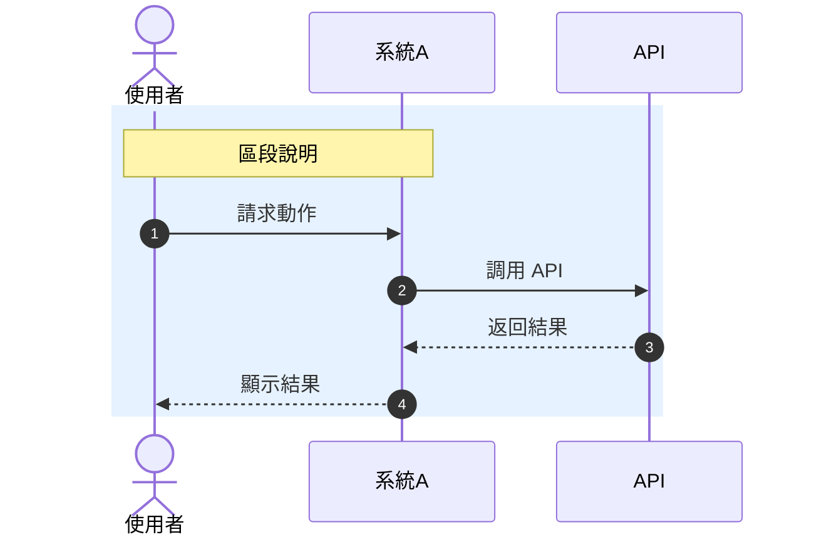
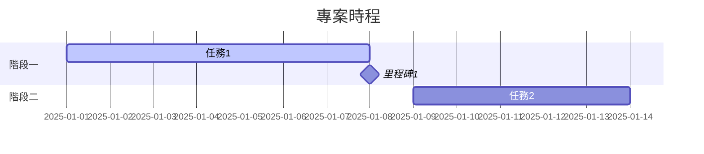
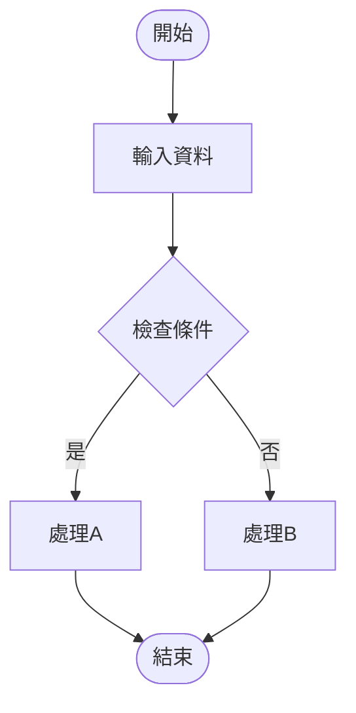
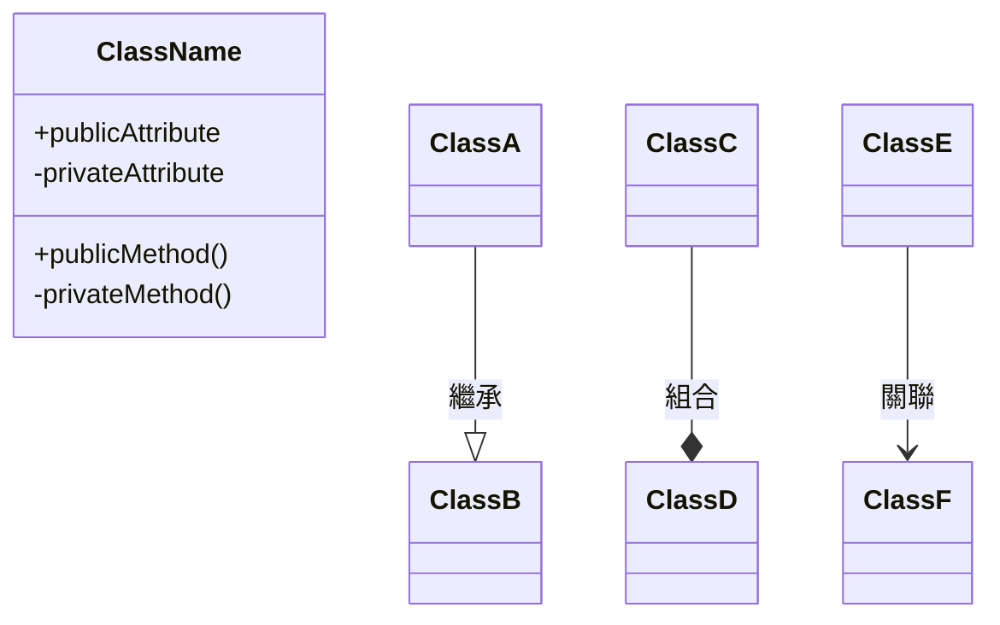
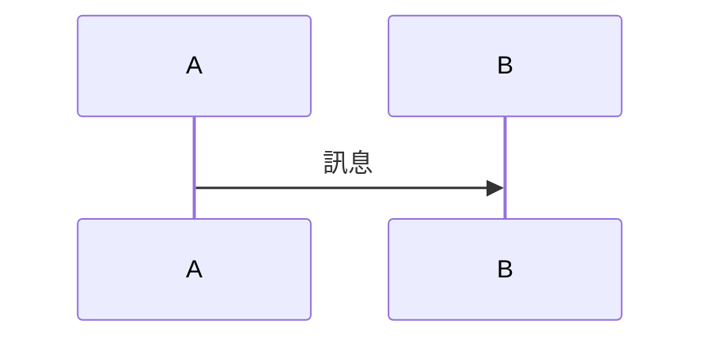
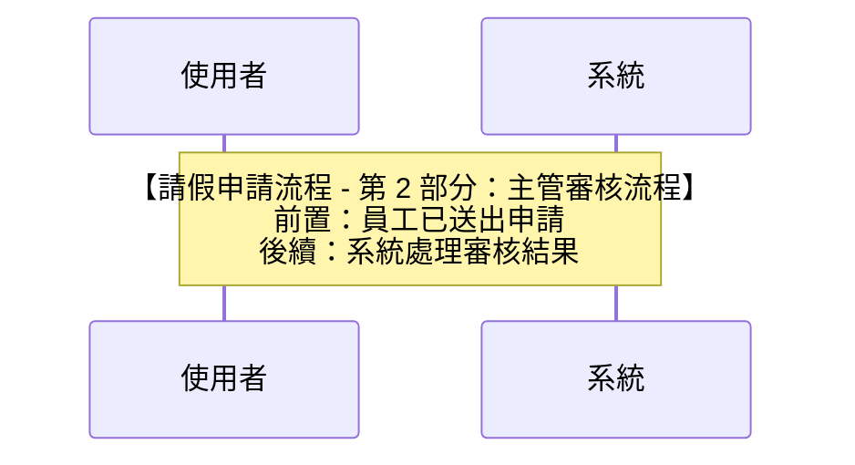
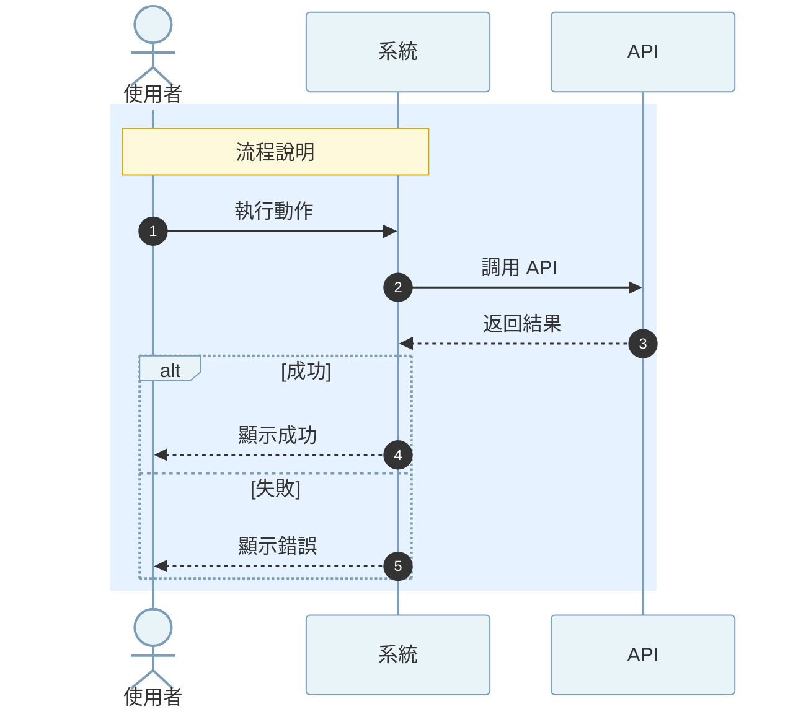
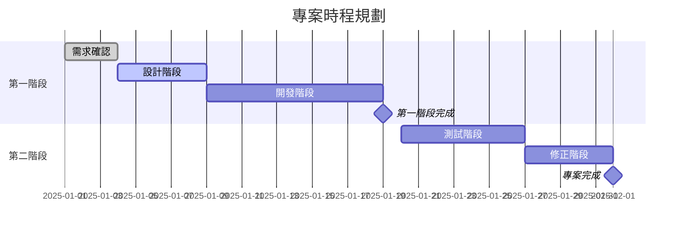

# Mermaid 圖表繪製指南

## 目的
統一專案中所有 Mermaid 圖表的視覺風格，確保圖表具有良好的可讀性和一致性。

---

## 標準主題配色
### 序列圖 (Sequence Diagram) 主題配置
```mermaid
%%{init: {'theme':'base', 'themeVariables': {
  'primaryColor':'#e8f4f8',
  'primaryTextColor':'#333',
  'primaryBorderColor':'#7C9CB8',
  'lineColor':'#5B9BD5',
  'secondaryColor':'#fff9e6',
  'tertiaryColor':'#f5f5f5',
  'background':'#ffffff',
  'mainBkg':'#ffffff',
  'noteBkgColor':'#fff9db',
  'noteTextColor':'#333',
  'noteBorderColor':'#d4aa00',
  'actorBorder':'#7C9CB8',
  'actorBkg':'#e8f4f8',
  'actorTextColor':'#333',
  'actorLineColor':'#7C9CB8',
  'signalColor':'#333',
  'signalTextColor':'#333',
  'labelBoxBkgColor':'#e8f4f8',
  'labelBoxBorderColor':'#7C9CB8',
  'labelTextColor':'#333',
  'loopTextColor':'#333',
  'activationBorderColor':'#7C9CB8',
  'activationBkgColor':'#d4e9f7',
  'sequenceNumberColor':'white'
}}}%%
```
### 配色說明

| 元素 | 顏色代碼 | 說明 |
|------|----------|------|
| **背景色** | `#ffffff` | 白色背景，確保在各種環境下顯示舒適 |
| **主要色** | `#e8f4f8` | 淡藍色，用於 Actor 背景 |
| **次要色** | `#fff9e6` | 淡黃色，用於次要元素 |
| **邊框色** | `#7C9CB8` | 深藍色，用於各種邊框 |
| **連接線** | `#5B9BD5` | 藍色，用於訊息箭頭 |
| **註解背景** | `#fff9db` | 淡黃色，用於 Note 區塊 |
| **註解邊框** | `#d4aa00` | 金色，用於 Note 區塊邊框 |
| **文字色** | `#333` | 深灰色，確保易讀性 |
| **啟用區背景** | `#d4e9f7` | 淺藍色，用於 activation box |

---

## 區段背景色規範

在序列圖中使用 `rect` 定義區段時，使用以下標準配色：

### 標準區段配色

```mermaid
%% 員工操作區段 - 淡藍色
rect rgb(230,242,255)
  %% 內容
end

%% 主管/管理操作區段 - 淡橘色
rect rgb(255,245,230)
  %% 內容
end

%% 系統/自動化流程區段 - 淡綠色
rect rgb(240,255,240)
  %% 內容
end

%% 錯誤/異常處理區段 - 淡紅色
rect rgb(255,240,240)
  %% 內容
end
```

### 區段配色用途

| 用途 | RGB 值 | 視覺效果 | 適用情境 |
|------|--------|----------|----------|
| **員工操作** | `rgb(230,242,255)` | 淡藍色 | 一般使用者操作流程 |
| **主管/管理** | `rgb(255,245,230)` | 淡橘色 | 管理者、審核者操作流程 |
| **系統流程** | `rgb(240,255,240)` | 淡綠色 | 自動化處理、背景作業 |
| **錯誤處理** | `rgb(255,240,240)` | 淡紅色 | 異常狀況、錯誤處理 |
| **中性區段** | `rgb(245,245,245)` | 淡灰色 | 通用區段、未分類流程 |

---

## 圖表類型指南

### 1. 序列圖 (Sequence Diagram)

**用途**: 描述系統間的互動流程、API 調用順序

**基本結構**:


**注意事項**:
- 使用 `autonumber` 自動編號訊息
- 使用 `actor` 定義真實使用者角色
- 使用 `participant` 定義系統/服務
- 使用 `note over` 添加說明
- 使用 `rect` 區分不同流程區段
- 使用 `alt`/`opt`/`loop` 表示條件與循環

### 2. 甘特圖 (Gantt Chart)

**用途**: 專案時程規劃、任務排程

**基本結構**:


**注意事項**:
- 使用 `section` 區分專案階段
- 使用 `milestone` 標記重要里程碑
- 使用 `active` 標記正在進行的任務
- 日期格式統一使用 `YYYY-MM-DD`

### 3. 流程圖 (Flowchart)

**用途**: 決策流程、演算法邏輯

**基本結構**:


**注意事項**:
- 使用有意義的節點 ID
- 使用 `([])` 表示開始/結束
- 使用 `{}` 表示判斷
- 使用 `[]` 表示處理步驟
- 箭頭上標註判斷條件

### 4. 類別圖 (Class Diagram)

**用途**: 系統架構、資料模型

**基本結構**:


---

## 檔案命名規範

### Mermaid 檔案命名

```
{專案編號}-{日期}-{圖表類型}.mermaid
```

**範例**:
- `ticket-001-20251107-流程圖.mermaid` - 流程圖/Flowchart/Activity Diagram
- `ticket-001-20251107-循序圖.mermaid` - 序列圖/循序圖/Sequence Diagram
- `ticket-001-20251107-甘特圖.mermaid` - 甘特圖/Gantt Chart
- `ticket-001-20251020-架構圖.mermaid` - 架構圖/類別圖/Class Diagram

**日期格式**: `YYYYMMDD` (例如：20251107 代表 2025年11月7日)

### 在 Markdown 中嵌入

使用程式碼區塊：

````markdown

````

---

## 最佳實踐

### ✅ 建議做法

1. **使用繁體中文**
   - 所有標籤、註解使用繁體中文（台灣）
   - 保持與專案術語對照表一致

2. **添加註解說明**
   - 在複雜流程中使用 `note` 添加說明
   - 在區段開始處說明該區段用途

3. **合理分段**
   - 使用 `rect` 將相關流程分組
   - 每個區段應有明確的職責

4. **保持簡潔**
   - 避免在單一圖表中放入過多細節
   - 複雜流程應拆分為多個圖表

5. **統一命名**
   - API 參與者命名：`API 1：功能說明`
   - 系統參與者命名：`系統名稱 as 顯示名稱`

### 複雜流程拆分圖表命名規則

當流程過於複雜需要拆分為多個圖表時，使用以下命名規範：

#### 基本格式
```
{專案編號}-{日期}-{圖表類型}-{流程名稱}-{序號}-{子流程說明}.mermaid
```

#### 命名要素說明

| 要素 | 說明 | 範例 |
|------|------|------|
| 專案編號 | 專案或票券編號 | `ticket-001` |
| 日期 | 圖表建立日期（YYYYMMDD） | `20251108` |
| 圖表類型 | 循序圖/流程圖/甘特圖等 | `循序圖` |
| 流程名稱 | 主要流程的名稱 | `請假申請` |
| 序號 | 01, 02, 03... | `01`, `02` |
| 子流程說明 | 該圖表的具體內容 | `員工送出申請`, `主管審核` |

#### 實際範例

**情境：請假申請流程拆分為三個圖表**

1. `ticket-001-20251108-循序圖-請假申請-01-員工送出申請.mermaid`
   - 包含：員工填寫表單、驗證資料、送出申請

2. `ticket-001-20251108-循序圖-請假申請-02-主管審核流程.mermaid`
   - 包含：主管收到通知、審核、核准/退回

3. `ticket-001-20251108-循序圖-請假申請-03-系統處理結果.mermaid`
   - 包含：更新假期餘額、發送通知、記錄歷史

**情境：電商訂單流程拆分**

1. `proj-ecommerce-20251108-循序圖-訂單處理-01-下單與付款.mermaid`
2. `proj-ecommerce-20251108-循序圖-訂單處理-02-倉儲揀貨.mermaid`
3. `proj-ecommerce-20251108-循序圖-訂單處理-03-物流配送.mermaid`
4. `proj-ecommerce-20251108-循序圖-訂單處理-04-退換貨處理.mermaid`

#### 拆分原則

**應該拆分的情境：**
- 參與者超過 6 個
- 訊息步驟超過 20 步
- 包含多個獨立的業務階段
- 圖表高度導致閱讀困難
- 不同角色關注不同階段

**拆分建議：**
1. **依據業務階段拆分**
   - 申請階段 → 審核階段 → 處理階段

2. **依據角色拆分**
   - 使用者操作流程 → 系統處理流程 → 管理員操作流程

3. **依據系統邊界拆分**
   - 前端互動 → 後端 API → 資料庫操作 → 第三方服務

4. **依據時序拆分**
   - 主要流程 → 異常處理 → 補償機制

#### 圖表間的關聯說明

在每個拆分圖表的開頭使用 `note` 說明其在整體流程中的位置：



#### 索引檔案建議

當流程拆分為多個圖表時，建議建立索引文件：

**檔案名稱**：`{專案編號}-{日期}-{流程名稱}-索引.md`

**範例**：`ticket-001-20251108-請假申請-索引.md`

**內容結構**：
```markdown
# 請假申請流程圖表索引

## 流程概覽
本流程共拆分為 3 個循序圖，涵蓋從員工申請到系統處理的完整流程。

## 圖表清單

### 1. 員工送出申請
- 檔案：`ticket-001-20251108-循序圖-請假申請-01-員工送出申請.mermaid`
- 說明：員工填寫請假表單、系統驗證、送出申請
- 參與者：員工、前端系統、後端 API

### 2. 主管審核流程
- 檔案：`ticket-001-20251108-循序圖-請假申請-02-主管審核流程.mermaid`
- 說明：主管收到通知、審核請假申請、核准或退回
- 參與者：主管、審核系統、通知服務

### 3. 系統處理結果
- 檔案：`ticket-001-20251108-循序圖-請假申請-03-系統處理結果.mermaid`
- 說明：更新假期餘額、發送結果通知、記錄歷史
- 參與者：後端系統、資料庫、通知服務

## 流程關聯
員工送出申請 → 主管審核流程 → 系統處理結果

## 更新記錄
- 2025-11-08：初版建立
```


### ❌ 避免做法

1. 不要混用中英文標點符號
2. 不要使用過於鮮豔或對比過高的顏色
3. 不要在圖表中放入過多文字說明
4. 不要省略必要的主題配置（會導致黑色背景）
5. 不要使用過時的 Mermaid 語法
6. 不要使用 emoji 或特殊符號作為名稱

---

## 常用程式碼片段

### 序列圖模板



### 甘特圖模板



---

## 工具與資源

### VS Code 擴充套件

建議安裝以下擴充套件以獲得最佳體驗：

- **Mermaid Preview** - 即時預覽 Mermaid 圖表
- **Markdown Preview Mermaid Support** - 在 Markdown 中預覽 Mermaid

### 線上工具

- [Mermaid Live Editor](https://mermaid.live/) - 線上編輯與預覽
- [Mermaid 官方文件](https://mermaid.js.org/) - 完整語法參考

---

## 檢查清單

在提交包含 Mermaid 圖表的變更前，請確認：

- [ ] 已套用標準主題配置（序列圖）
- [ ] 區段背景色符合規範
- [ ] 所有文字使用繁體中文（台灣）
- [ ] 術語與專案對照表一致
- [ ] 圖表在預覽中顯示正常（無黑色背景）
- [ ] 檔案命名符合規範
- [ ] 圖表邏輯清晰、易於理解
- [ ] 已添加必要的註解說明